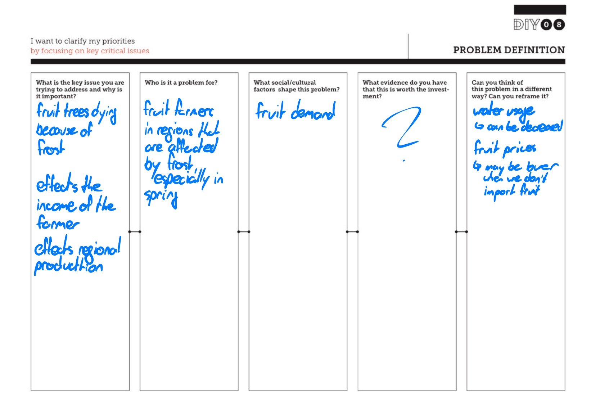
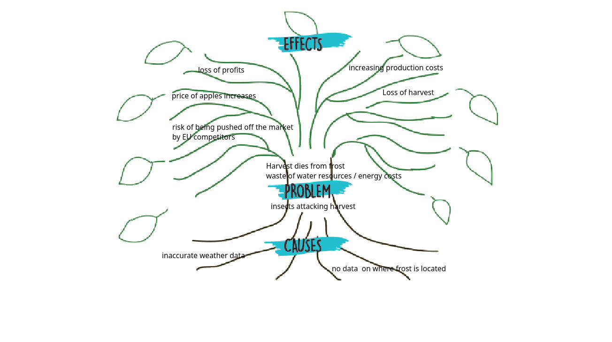
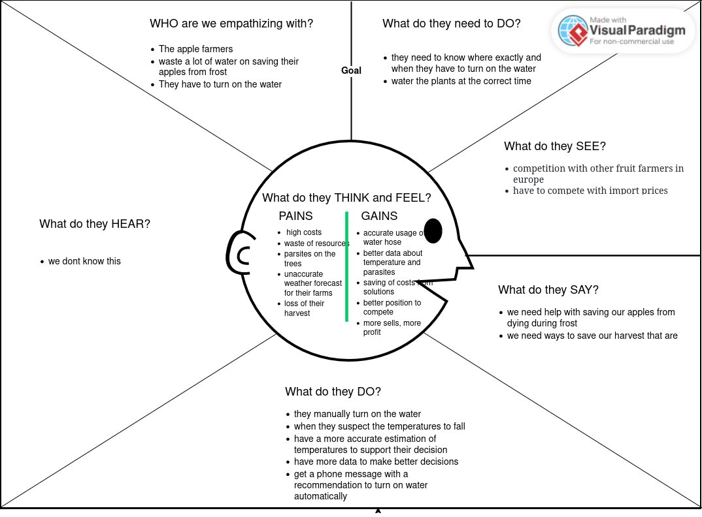
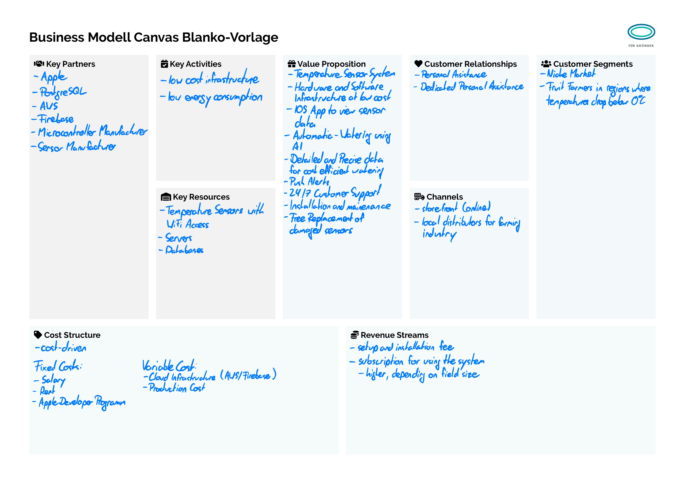

# FrostGuard

The FrostGuard App and the related sensor is our solution to this problem.

## Individual Learning Goal

### Learning Goal:

Improve skills in combining hardware (Arduino, Raspberry Pi) with software, focusing on real-time data transmission, building APIs, and setting up alert systems.

### Reflection:

The project provided valuable experience in connecting hardware with software, designing an efficient backend, and implementing a working notification system. The next step is to explore IoT further and refine real-time data handling techniques.
## Problem Definition

## Empathize and Define

## Ideate
Group: Jonatan Goldbach, Nasibullah Nasiri, Felix Evers (Group 30)

### The Problem:
The harvest is being lost due to frost, inaccurate weather data, and competition from other markets.

#### Round 1:

    Idea 1: Use technology that tracks frost in real-time, so we can protect the crops.
    Idea 2: Partner with weather experts to get better forecasts.
    Idea 3: Plant apple varieties that are stronger and can survive cold weather.

#### Round 2:

    Idea 1: Install smart irrigation systems that save water by only using it when needed.
    Idea 2: Market local apples as high-quality to stand out from cheaper imports.
    Idea 3: Use drones to check for insects and apply pesticides only where necessary.

#### Round 3:

    Idea 1: Use renewable energy like solar panels or wind to heat the farm when it’s cold.
    Idea 2: Form a group with other farmers to reduce costs and compete with larger companies.
    Idea 3: Use organic pesticides that protect the crops without harming the environment.

#### Round 4:

    Idea 1: Use artificial intelligence to predict frost and plan the harvest ahead of time.
    Idea 2: Apply for government grants that support eco-friendly farming.
    Idea 3: Train farmers to use water and energy efficiently to reduce waste.

## Business Model Canvas

